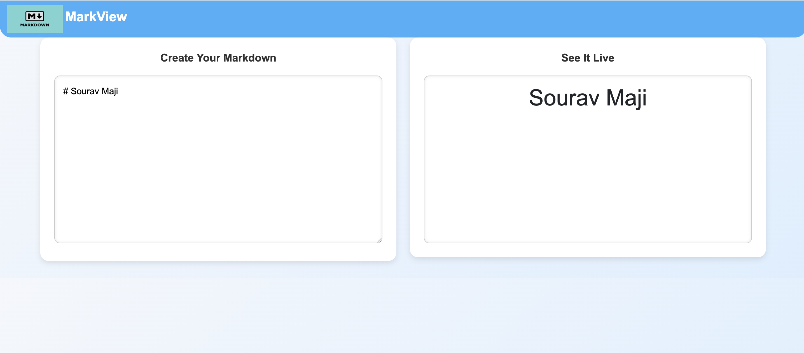

# *MarkView*

MarkView  is a simple web application that allows users to write Markdown content in a text area and see a live preview of the rendered HTML on the right side. It’s a handy tool for writers, bloggers, and developers to check how their Markdown content will look when rendered.

---

## Demo  


---

## Live Project URL  
[Live URL]()

---

## Features
1. **Live Markdown Preview**: As you type in the textarea, the right side displays the rendered Markdown in real-time.
2. **Responsive Design**: The layout adjusts to both desktop and mobile screens for a seamless experience.
3. **Error Handling**: If invalid Markdown is entered, the app displays an error message in the preview area.
  
---

## Installation
To use this application, follow these steps:

1. Clone the repository:

    ```bash
    git clone 
    ```

2. Navigate into the project folder:

    ```bash
    cd MarkView
    ```

3. Open the `index.html` file in your browser to view the application. Simply double-click `index.html` or open it in any modern web browser.

---

## Files

1. **index.html**: The main HTML file that contains the structure of the application, including the Markdown input area and the preview section.
2. **styles.css**: The CSS file that styles the editor and preview area, along with theme switching and responsive layout adjustments.
3. **script.js**: The JavaScript file that powers the Markdown-to-HTML conversion using the `marked` library and handles live preview and debouncing.
4. **README.md**: This file explaining how to set up and use the project.

---

## Usage
- **Writing Markdown**: Type your Markdown content in the left-hand textarea. The right-hand preview section will automatically update as you type.
- **Live Preview**: The preview area shows the live-rendered HTML from the Markdown you write in real-time.

---

## Dependencies

1. **Marked.js**: The app uses [Marked.js](https://marked.js.org/) for converting Markdown syntax into HTML.
2. **Bootstrap 5**: For responsive and modern layout design.

---
